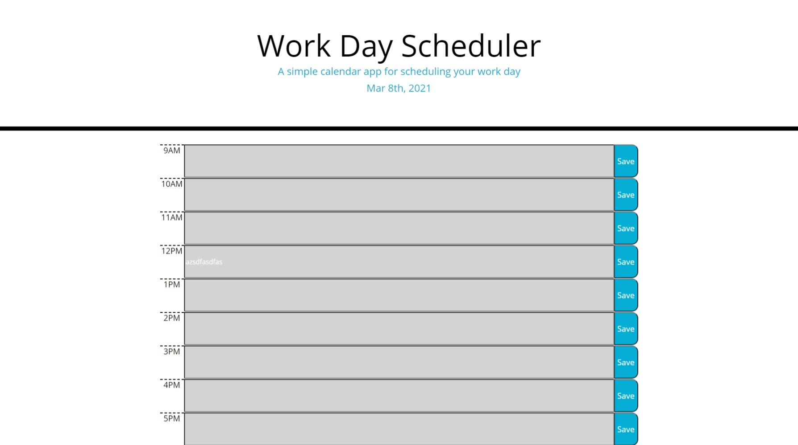

# scheduler

## Description

This is a simple day planner that shows the current date, and offers time-blocks to add to do tasks throughout the day. The blocks will change color to display whether they are in the past, present or future. The user should be able to input a task and it will save in the local storage, so that the data does not disappear when the user refreshes or leaves the page. 

Below is a screenshot of the planner

Click the link to deploy the application
<https://sosoberg.github.io/scheduler/>